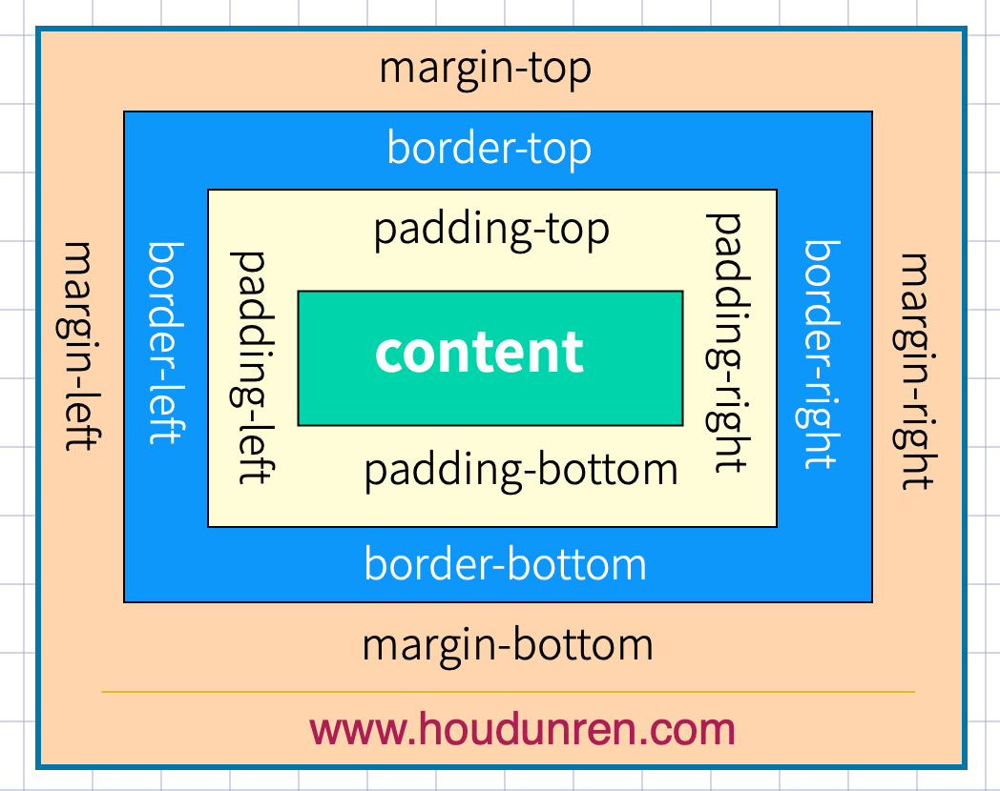
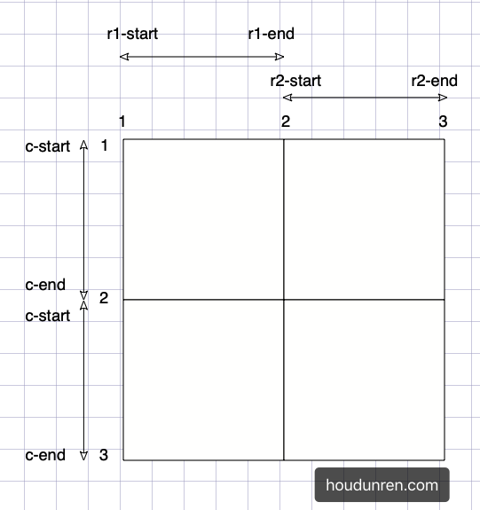
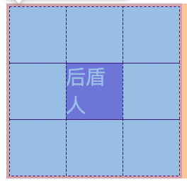

# CSS总结

> https://houdunren.gitee.io/note/
>
> 对原链接的CSS文档，学习过程中的不完整总结，谢谢原作者的贡献👏

## 文本控制

### 文本基础

```css
字体设置
font-family: 'Courier New', Courier;
引入字体
@font-face {
  font-family:"houdunren";
  src: url("SourceHanSansSC-Heavy.otf") format("opentype"),
    url("SourceHanSansSC-Light.otf") format("opentype")
}

字重定义
取值范围 nromal | bold | bolder | lighter | 100~900
font-weight:normal;

文本字号
取值范围 xx-small | x-small | small | medium | large | x-large | xx-large | 百分数 | em(等同百分数)
font-size:20px;

文本颜色
color: red | #ddffee | rgb() | rgba()

行高定义
line-height: 2em;

倾斜风格
font-style: italic

组合定义
必须有字体规则
必须有字符大小规则
font: (bold italic) 20px/1.5 'Courier New', Courier, monospace;
```


### 文本样式

```css
大小写转换
小号大写字母
font-variant: small-caps;
大小写转换
text-transform: capitalize | uppercase | lowercase;

文本线条
text-decoration: none | underline | line-through | overline;

阴影控制
参数顺序： 颜色，水平便宜，垂直偏移，模糊范围
text-shadow: rgba() 3px 3px 5px;

空白处理
white-space: pre | nowrap | pre-wrap | pre-line
分析字符串中的 [\s \n <br> 容器大小]。根据各个参数的规则来执行换行。

文本溢出
单行文本
overflow-wrap: break-word;
text-overflow: ellipsis;
overflow: hidden;
多行文本
display: -webkit-box;
-webkit-box-orient: vertical;
-webkit-line-clamp: 2;
表格文本溢出
white-spane: nowrap;
overflow:hidden;
text-overflow: ellipsis;
```


### 段落控制

```css
文本缩进
text-indent: 2em;

水平对齐
text-align: center | left | right;

垂直对齐
向上突出 | 向下突出 | 位于基线 | 位于文字顶端 | 中间
vertical-align: top | bottom | baseline | text-top | middle

字符间隔
word-spacing: 2em; 
letter-spacing:3em;

排版模式
writing-mode: horizontal-tb | vertical-rl | vertical-lr
```


## 盒子模型

### 盒子模型




### 外边距

```css
声明定义
顺时针

居中设置
margin: auto;

负值设置
margin: -50px;

边距合并
相邻元素纵向外边距会合并
```


### 内边距

```
使用 padding 定义
```


### BOX-SIZING

```css
内容盒子 | 包括边框
box-sizing: content-box | border-box
```


### 边框设计

```css
border-style:none | dotted | dashed | solid | double | groove | ridge

border-[top|right|bottom|left]-[style|width|color]

行元素也可以设置边框

border-radius: px | %

```


### 轮廓线

```css
轮廓线在元素获取焦点时产生，不占用空间。

线条样式：
ontline-style: none | dotted | dashed | solid | double | groove | ridge 

线宽设置：
outline-width

线条颜色
outline-color

组合定义：
outline: red solid 2px;
```


### DISPLAY

```css
display: none | block | inline | inline-block
```


### VISIBILITY

```css
控制元素的隐藏，位置保留。
```


### 溢出控制

``` css
隐藏 | 滚动条 | 自动
overflow: hidden | scroll | auto

多行文本溢出控制
display: -webkit-box;
-webkit-line-clamp: 3;
-webkit-box-orient: vertical;
```


### 尺寸定义

```css
min-width min-height
max-width max-height
fill-availabel
fit-content

fill-available使用要添加前缀
display: inline-block;
width: -webkit-fill-available;
height: -webkit-fill-available;

fit-content
根据内容自动设置宽度

按照内容的最大最小尺寸
min-content
max-content
```

## 背景样式

### 背景样式

```css
背景颜色
rgb | rgba | #hex

背景图片 png | gif | jpeg
background-image:url(···)

背景裁切
包括边框 | 不含边框，包含边距 | 内容区域
background-clip: border-box | padding-box |content-box

背景重复
background-repeat: repeat | repeat-x | repeat-y | no-repeat | space

背景滚动，页面滚动是的图片处理方式
背景滚动 | 背景固定
background-attachment:fixed | scroll

背景位置
background-position:left | right | center | top | bottom

背景尺寸: 
背景完全覆盖，可能会有背景溢出 | 背景不完全覆盖，没有溢出。
background-size:cover | contain | px | % | auto

多个背景
background: url(xj-small.png) left 50% no-repeat,
                url(bg.png) right 100% no-repeat red;

组合设置
background: red url(xj-small.png) no-repeat right 50% fixed;
```


### 盒子阴影

```css
box-shadow: 水平偏移 | 垂直偏移 | 模糊度 | 颜色
```


### 颜色渐变

```css
线性渐变
background: linear-gradient(red, green);
background: linear-gradient(30deg, red, green);
background: linear-gradient(to right, red, green)
background: linear-gradient(to left, red, green);
background: linear-gradient(to top left, red, green);
background: linear-gradient(to right bottom, red, green);
background: linear-gradient(red, rgb(0, 0, 200), green, rgba(122, 211, 100, 0));

径向渐变
background: radial-gradient(red, blue, green);
background: radial-gradient(100px 200px, red, blue, green);
background: radial-gradient(at bottom left, red, blue);
background: radial-gradient(at bottom right, red, blue);
background: radial-gradient(at center left, red, blue);
background: radial-gradient(at 50% 100%, red, blue);

标识位
background: linear-gradient(45deg, red 50%, blue 0%);

渐变重复
background: repeating-linear-gradient(90deg, blue, 25px, yellow 25px, 25px, red 50px);

径向重复
background: repeating-linear-gradient(90deg, blue, 25px, yellow 25px, 25px, red 50px);
```

## 数据样式

### 表格

```css
定制表格
可以使用css画表格
display：xxx
table = table
table-caption = caption
table-row = tr
table-row-group = tbody
table-header-group = thead
table-footer-group = tfooe

表格标题
caption-side: top | bottom

内容对齐
水平对齐使用： text-align
垂直对齐： vertical-align

颜色设置
与普通标签相同

边框间距
border-spacing:50px 10px;

边框合并
border-collapse:collapse;

隐藏单元格
empty-cell:hide

无边框表格
border:none;
border-collapse: collapse;

数据表格
使用伪类控制样式
```


### 列表

```css
列表符号
设置列表样式，规则是继承的
list-style-type:xxx
隐藏符号列表
list-style-type:none
自定义符号列表
可以使用图片，渐变
list-style-image: url(xj-small.png);
list-style-image: radial-gradient(10px 10px, red, black);
list-style-image: linear-gradient(45deg, red, black);

符号位置
控制符号显示在内容外面还是内部
list-style-position: inside | outside

组合定义

背景符号
background: url(xj-small.png) no-repeat 0 6px;
background-size: 10px 10px;
list-style-position: inside;
list-style: none;
text-indent: 15px;
```


### 追加内容

```
基本使用
伪类 ::before 向前添加内容，:：after 向后添加内容

提取属性
a::after {
	content:attr(href);
}

自定义表单

```

## 浮动布局

### 浮动布局

```css
float: left | right | none
控制相邻元素之间的排列

文档流
没有设置浮动的块元素是独占一行的。
并且浮动是对后面的元素的影响，对前面的元素没有影响

丢失空间
对第一个元素设置浮动，后面的元素会占据第一个元素的位置。好像位置消失了

使用浮动
都是用浮动会并列显示

浮动边界
浮动元素边界不能超过父元素的 padding

浮动转块
元素浮动后会变为块元素，可以设置宽高。包括行元素
```


### 清除浮动

```css
不希望元素受到浮动元素的影响，可以清除浮动

CLEAR
如果元素之前有浮动元素，出现了丢失空间的现象，使用清除浮动可以恢复到浮动之前的效果。
float:clear

AFTER
使用::after 伪类在父元素后面添加标签
content: "";
display: block;
clear: both;

OVERFLOW
子元素浮动后没有高度，父元素产生BFC 机制，父元素会计算浮动元素的高度。
overflow:hidden
```


### 页面布局

```
父容器
```


### 形状浮动

```css
距离控制
外边距环绕 | 内边距环绕 | 边线环绕 | 内容环绕
shape-outside: margin-box | padding-box | border-box | content-box

显示区域
clip-path: circle(50% at center);
clip-path: ellipse(50% 80% at 100% 0);
clip-path: ellipse(50% 80% at 100% 0);

内移距离
使用 inset 属性控制环绕向内移动的距离
shape-outside: inset(50px 30px 80px 50px) padding-box;

环绕模式
shape-outside: circle(50%) padding-box;
shape-outside: ellipse(80px 70px) padding-box;
shape-outside: polygon(50px 0px, 0 100px, 100px 100px);
```

## 定位布局

### 基础知识

```css
position: static | relative | absolute | fixed | sticky
```


### 相对定位

```
相对于原位置，原位置留白
```


### 绝对定位

```css
不受文档流的影响

参照元素
父元素设置 relative | fixed | sticky,子元素参照父元素。

默认位置
会受到父元素的 padding 影响。

设置尺寸
可以通过定位设置元素的尺寸。

居中定位
将 left 设置为50%，然后向左偏移元素宽度的一半。

滚动行为
固定定位的元素会随着滚动条滚动。
父元素：
position: relative;
overflow: scroll;
子元素：
position: absolute;

图标定位
使用绝对定位
```


### 纵向重叠

```css
元素重叠在一起，使用 z-index 控制上下级关系。
父元素设置 z-index 没有意义，子元素永远在父元素上。
```


### 固定定位

```css
元素相对于窗口的位置
```


### 粘性定位

``` css
同级定位
后面元素与前面的元素重叠
非同级定位
后面元素挤掉前面的元素
```

## 弹性布局

### 弹性盒子

``` css
声明定义
display:flex;

控制和子元素排列的方向
从左到右 | 从右到左 | 从上到下 | 从下到上
flex-direction:row | row-reverse | column | column-reverse

规定 flex 容器是单行还是多行，同时规定横轴的方向
元素不拆行不拆列 | 元素拆行拆列 | 元素反向拆行拆列
flex-wrap: nowrap | wrap | wrap-reverse

flex-flow
是 flex-direction 和 flex-wrap 的组合简写
flex-flow: row-reverse wrap-reverse;

轴说明
水平排列➡⬇
flex-flow: row wrap
⬅⬆
flex-flow:row-reverse wrap-reverse
垂直排列⬇➡
flex-flow: column wrap;

控制元素在主轴上的排列方式
紧靠主轴起点 | 紧靠主轴重点 | 从弹性容器中心开始 | 第一个元素紧靠起点，第二个元素紧靠重点，余下平坦 | 元素两侧空间均等 | 元素间距离平均分配
justify-content:flex-start | flex-end | center | space-between | space-around | space-evenly

交叉轴行
align-items 控制元素在行上的排列
align-content 控制[行]在交叉轴上的排列

元素被拉伸 | 元素位于容器中心 | 位于容器的交叉轴开头 |位于容器的交叉轴末端
align-items:stretch | center | flex-start | flex-end

align-content:stretch | flex-start | flex-end | center | space-between | space-around | space-evenly
```


### 弹性元素

``` css
在弹性容器中的元素属于弹性元素
不能使用 float clear 规则
绝对定位的弹性元素不参与弹性布局

用于控制单个元素在交叉轴上的排列方式。
align-self: stretch | flex-start | flex-end | center


flex-grow
将弹性盒子的可用空间，分配给弹性元素。可以使用整数和小数。

flex-shrink
空间不足的缩小值

flex-basis
定义项目占据的主轴空间，优先级大于 width height。

flex
是flex-grow flex-shrink flex-basis的组合

order
用于控制弹性元素的位置，默认为 order:0,数值小的在前面。
```


### 弹性文本 

``` css
文本节点也在弹性布局的操作范围内
```


### 绝对定位

``` css
绝对定位元素，不参与弹性布局。
```


### 自动空间

``` css 
margin-right:auto 
自动盛满空间
```

## 栅格系统

### 声明容器

``` css
块级容器
grid-template-rows: 50% 50%;
grid-template-columns: 25% 25% 25% 25%;

行级容器
display:inline-grid;
```

### 划分行列

``` css
像素 | 百分比 | 重复 | 以100px填充 | 比例分割 | 自动填充
grid-template-rows: px | % | repeat() | repeat(auto-fill, 100px) | 1fr 2fr | auto
grid-template-columns: px | % | repeat() | repeat(auto-fill, 100px) | 1fr 2fr | auto

先行后列
grid-template: 10vh 20vh 10vh/ 30vw 1fr;

minmax
grid-template-rows: 100px minmax(100px, 1fr);
```


### 间距定义

``` css
行间距
row-gap

列间距
column-gap

组合定义
gap: 20px 10px;
```


### 栅格命名

独立命名



``` css
grid-template-rows: [r1-start] 100px [r1-end r2-start] 100px [r2-end r3-start] 100px [r3-end];
```

自动命名



``` css
grid-row-start: r2-start;
grid-column-start: c1-end;
grid-row-end: r2-end;
grid-column-end: c3-start;
```

### 元素定位

|   **样式属性**    |   **说明**   |
| :---------------: | :----------: |
|  grid-row-start   | 行开始栅格线 |
|   grid-row-end    | 行结束栅格线 |
| grid-column-start | 列开始栅格线 |
|  grid-column-end  | 列结束栅格线 |

属性值： line | span | span 名称 | auto

``` css
根据栅格线
grid-row-start: 2;
grid-row-end: 4;
grid-column-start: 2;
grid-column-end: 4;

根据栅格命名
grid-row-start: r1-end;
grid-column-start: c2-start;
grid-row-end: r3-start;
grid-column-end: c3-start;
根据自动命名
同上

根据偏移量
grid-row-start: span 2;
grid-row-end: span 2;
grid-column-start: span 2;
grid-column-end: span 2;

简写模式
grid-row: 2/4;
grid-column: 2/4;

grid-area
语法结构
grid-row: 2/4;grid-row-start/grid-column-start/grid-row-end/grid-column-end。
grid-area: 2/2/3/3;
```

### 区域定位

``` css
通过 grid-area 属性将元素放在指定区域中。

编号定位
grid-area: 2/2/4/4;

命名定位
grid-area: r 2/l 2/r 4/l 4;
```


### 区域声明

grid-template-areas 可以定义栅格区域，栅格区域必须是矩形。

``` css
区域布局
grid-template-rows: 80px 1fr 50px;
grid-template-columns: 100px 1fr 50px 60px;
grid-template-areas: "header header header header"
										 "nav main main aside"
            				 "footer footer footer footer";

简写形式
grid-template:'header header header header' 80px
      				'nav main main aside' auto
      				'footer footer footer footer' 50px/100px auto 50px 60px;

区域命名
使用.来占位
grid-template-rows: repeat(3, 33.3%);
grid-template-columns: repeat(3, 33.3%);
grid-template-areas: "top . ."
            				 "top . ."
            				 "bottom bottom bottom";
```

### 栅格流动

``` css
grid-auto-flow:column | row | dense 
按列 | 按行 | 元素前面空余栅格
改变单元流动方式，跟弹性布局的元素排列类似。

强制填充
grid-auto-flow: row dense;
填充元素之间的空白。
```


### 对齐管理

```css
所有栅格在容器中的对对齐
justify-content
align-content
所有元素在栅格中的对齐
align-items
justify-items
元素在栅格中的对齐
align-self
justify-self

栅格对齐
justify-content:start | end | center | stretch | space-between | space-around | space-evenly
align-content:start | end | center | stretch | space-between | space-around | space-evenly

元素对齐
justify-items:start | end | end | center | stretch
align-items:start | end | end | center | stretch

元素独立控制
justify-self:start | end | end | center | stretch
align-self:start | end | end | center | stretch

组合简写
place-content: <align-content> <justify-content>
place-items: <align-items> <justify-items>
place-self: <align-self> <justify-self>
```


### 自动排列

```css
栅格无法防止内容时候，系统自动添加栅格

属性说明
grid-auto-rows
grid-auto-column

自动行列
grid-auto-columns: 10vw;
grid-auto-rows: 10vh;
```


### 终极简写

``` css

```


## 变形动画

### 基础知识

X轴➡，Y轴⬇，左手旋转。

```css
使用 transform 属性进行操作
transform: none 
					translate | translate3d | translateX | translateY | translateZ
					scale | scale3D | scaleX | scaleY | scaleZ
					rotate | rotate3D | rotateX | rotateY | rotateZ
					skew | skewX | skewY
					perspective
					
变形叠加
重复的设置变形属性，会覆盖原有属性。不会叠加。

行级元素
行级元素不产生变形效果，转化为 inline-block 或者 block可以进行变形
```


### 伪类状态

``` css
:hover 鼠标放上去
:target 
```


### 移动元素

```css
translateX | translateY | translate

百分比移动
百分比参照自身大小

translateZ
证书向外，负数向里。

translate3d
同时控制x y z的移动。

渐变表单
```


### 缩放元素

注意，scale不是变动元素的宽高纵深，而是将坐标轴的刻度放缩。

perspective不受这个属性影响。

``` css
transform: scaleX(.5);	x轴缩放一般
transform: scaleY(.5);	y轴缩放一般
transform: scale(.5, 2);	x轴缩小，y轴放大
transform: scaleZ(3);	z轴缩小
scale3d	以上属性综合

菜单缩放
相册放大
```


### 旋转操作

注意，在旋转的时候，坐标轴也会跟着旋转。

``` css
rotateX rotateY rotateZ
rotate组合

rotate3d(tx,ty,tz,angle)
3d旋转是按照向量的方向进行的。

参数顺序
参数不同，结果不同

旋转文字
电子时钟
```


### 倾斜操作

x轴与y轴的剪切变形方向不太一样，需要注意。

```
特效按钮
立体按钮
```


### 变形基点

```css
使用 transform-origin 设置元素的基点
transform-origin: right bottom;

变形顺序的影响
设置 transform 变形的前后顺序对最终的变形结果是有影响的。
```


### 透视景深

``` css
perspective

舞台透视
将 perspective 属性设置在父元素上，会有舞台效果，每个元素的透视效果不同

单独透视
将 perspective 属性设置在子元素上，每个元素的透视效果相同
```


###  3D透视

``` css
transform-style:flat | preserve-3d
2d舞台 | 3d舞台
```


### 观看视角

``` css

```


## 媒体查询

``` css
媒体设备
all | screen | print | speech
style
<style media="screen">
<style media="print">

link
<link rel="stylesheet" href="common.css">
<link rel="stylesheet" href="screen.css" media="screen">
<link rel="stylesheet" href="print.css" media="print">

@import
使用@import 可以引入指定设备的样式规则。文件中引入一个样式文件，在这个文件中再引入其他媒体的样式文件。
<link rel="stylesheet" href="style.css">
 	style.css:
	@import url(screen.css) screen;
	@import url(print.css) print;

@media
@media screen
@media print
  
多设备支持
<link rel="stylesheet" href="screen.css" media="screen,print"> 
```


## 相应尺寸

``` css
viewport
移动端使用的viewport来显示的
使用<meta name="viewport" content="width=2000px" />可以调整视口

系统提供的 device-width 变量值用于识别设备宽度
<meta name="viewport" content="width=device-width" />

其他属性
initil-scale	初始化缩放比例
minimum-scale	最小缩放
maximum-scale	最大放大
user-scalable	是否允许用户缩放

js延迟
user-scalable = no 可以解决300延迟问题
```


### rem/em

``` css
em 是一个继承属性。会继承父级的属性值。

padding/margin 属性使用 em 会参考本元素的 font-size 值，不会参考父级

rem本向也有em的特性即参考继承，只不过它只参考根元素（root）即html标签定义的font-size。
```


### 尺寸响应

``` css
实际操作中不同设备只能取宽或高一个尺寸为响应处理，一般情况下我们取宽度响应，高度自动处理。

rem是在根元素中定义的font-size
rem用来在多个设备响应处理时使用
html元素也可以使用:root选择器选择
```

