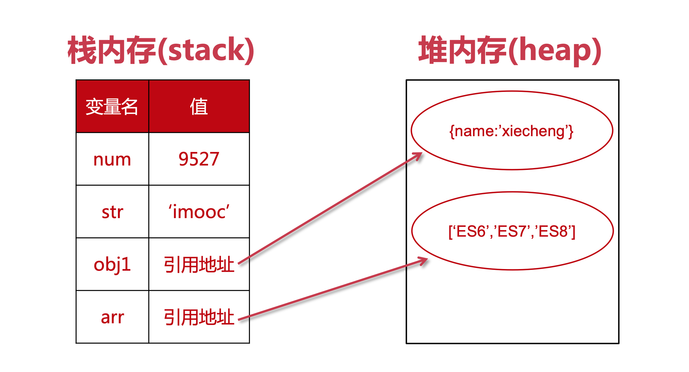

# ES6语法解析学习

> http://es.xiecheng.live/
>
> 学习文档过程中的不完善笔记，感谢作者的贡献👏

## 新的声明方式

### 作用域

作用域：全局作用域、函数作用域、块状作用域、动态作用域。

#### 函数作用域

获取函数作用域的方法：return 或者 闭包。

``` javascript
//闭包
function outside(){
  var name = 'a';
  function inside(){
    return name;
  }
  return inside();
}
```


#### 块状作用域

就是 {} 包裹的地方

``` javascript
if (true) {
    let a = 1
    console.log(a)
}
```


#### 动态作用域

变量的作用域是在定义的时候决定的。

### let

let 声明的全局变量不是全局对象的属性

let 定义变量不允许重复声明

let声明的变量不存在变量提升

``` javascript
function foo() {
    console.log(a)
    let a = 5
}

foo()
// Uncaught ReferenceError: Cannot access 'a' before initialization
```

let 声明的变量存在暂时性死区

``` javascript
var a = 5
if (true) {
    a = 6
    let a
}
// Uncaught ReferenceError: Cannot access 'a' before initialization

//比较隐蔽的
function foo(b = a, a = 2) {
    console.log(a, b)
}
foo()
// Uncaught ReferenceError: Cannot access 'a' before initialization
```

let 声明的变量有块级作用域

``` javascript
{
    let a = 5
}
console.log(a) // undefined
//代码块是在 {} 内部定义的，外部无法访问。
```

### const

const 定义的常量必须同时进行初始化

基本数据类型存储在 **栈内存** 中，引用数据类型存储在 **堆内存** 中。



const 无法保证引用数据类型不改动。只能保证变量指向的那个内存地址中的值不改动。

可以使用 `Obeject.freeze(obj)` 对引用进行浅层冻结。

## 解构赋值

### 数组的解构赋值

赋值元素可以是任意的可遍历对象。

被赋值的变量还可以是对象的属性

解构赋值可以在循环体中使用，配合 entries

``` javascript
let user = {
  name: 'John',
  age: 30
}

// loop over keys-and-values
for (let [key, value] of Object.entries(user)) {
  console.log(`${key}:${value}`) // name:John, then age:30
}

//map 对象依然适用
let user = new Map()
user.set('name', 'John')
user.set('age', '30')

for (let [key, value] of user.entries()) {
  console.log(`${key}:${value}`) // name:John, then age:30
}
```

可以跳过赋值元素，如果想忽略数组的某个元素对变量进行赋值，可以逗号来处理。

rest 参数。使用 rest 参数来接受赋值数组的剩余参数，不过必须放在赋值变量的后面。

``` javascript
let [name1, name2, ...rest] = ["Julius", "Caesar", "Consul", "of the Roman Republic"]

console.log(name1) // Julius
console.log(name2) // Caesar
```

### 对象解构赋值

基本用法，左侧赋值结构必须与右边一样，顺序可以不同

``` javascript
let options = {
  title: "Menu",
  width: 100,
  height: 200
}

let {title, width, height} = options
//等同于
let {title: title, width: width, height: height} = options

let {width: w, height: h, title} = options
```

赋值可以指定默认值

``` javascript
let {width = 100, height = 200, title} = options
```

rest 运算符，与数组中的用法类似，用来承接剩余的参数，一定要放在后面。

嵌套赋值，只要左边赋值元素与右边结构一致，就可以被赋值。

### 字符串解构赋值

``` javascript
let str = 'imooc'

let [a, b, c, d, e] = str 
```

## Array

### es5 中数组遍历方式

for 循环

``` javascript
for (let i = 0; i < arr.length; i++) {
    console.log(arr[i])
}
```

forEach() 没有返回值，只是针对每个元素调用 function

``` javascript
arr.forEach(function(elem, index, array) {
    if (arr[i] == 2) {
        continue
    }
    console.log(elem, index)
})
```

map() 返回新的数组，每个元素为调用 func 的结果

filter() 返回符合 func 条件的元素数组

some() 返回boolean，判断是否有元素符合 func 条件

every() 返回boolean，判断每个元素都符合func条件，every 可以做到 break 的效果。

reduce() 接受一个函数作为累加器

for...in 也可以遍历数组，不推荐

### es6 中数组遍历方式 for...of

 ``` javascript
for (variable of iterable) {}
//es6 允许开发者自定义遍历，任何数据结构都可以自定义实现一个遍历，这个遍历不能被 for for...in 理解。
// for...of 可以支持 continue break
 ```


### Array.from()

js 中有一些伪数组，看着像数组，但是不能使用数组的API

``` javascript
//伪数组特征，使用索引存储值，有 length 属性。
let arrayLike = {
  0:'a',
  1:'b',
  2:'c',
  length:3
}
```


比如函数的 arguments、DOM中的 NodeList

使用 call 改变数组方法的上下文，来间接使用数组方法。

```javascript
let args = [].slice.call(arguments)
let imgs = [].slice.call(document.querySelectorAll('img'))
```

使用 Array.from 

``` javascript
let args = Array.from(arguments);
let imgs = Array.from(document.querySelectorAll('img'));
```

语法

``` javascript
Array.from(arrayLike[, mapFn[, thisArg]])
arrayLike //伪数组 or 可迭代对象
mapFn //每个元素执行的回调函数
thisArg //回调函数的 this 对象
```

初始化一个数组

``` javascript
let arr = Array.from({
  length:5
},function() {
  return 1
})
```


### Array.from()

可以创建数组，不固定长度。

``` javascript
Array.of(7); // [7]
Array.of(1, 2, 3); // [1, 2, 3]

//Array() 创建的是 empty 数组，不是 undefined
Array(7); // [ , , , , , , ]
Array(1, 2, 3); // [1, 2, 3]
```

### Array.prototype.fill()

填充数组的方法

语法

``` javascript
arr.fill(value[, start[, end]])
value //填充的值
start //起始索引
end //结束索引，不包含。默认 this.length

Array(5).fill(1)
//[1,1,1,1,1]
//可以看到，单数值的时候，默认全部填充
```

### Array.prototype.find()

返回使 **回调函数返回true** 的数组中的第一个**值**

语法

``` javascript
arr.find(callback[, thisArg])
callback // 接收 element, index ,array
thisArg //回调函数的 this 对象
```

Array.prototype.findIndex()

返回使 **回调函数返回true** 的数组中的第一个值的**索引**

语法

``` javascript
arr.findIndex(callback[,thisArg])
callback //接收 element index array
thisArg //回调函数的 this 对象
```

### Array.prototype.copyWithin()

在数组内部，将指定位置的成员复制到其他位置

语法

``` javascript
arr.copyWithin(target, start = 0, end = this.length)
target //目标位置
start //读取起始位置，默认0
end //读取结束位置，不包含。默认 this.length
```

## Function

#### 默认参数

``` javascript
function f(x, y = 7, z = 42) //默认参数
function f(x, y = 7, z = x + y) //支持运算
function ajax(url, { //奇怪写法
    body = '',
    method = 'GET',
    headers = {}
} = {})
```

判断 function 的参数

``` javascript
arguments.length //函数执行时传入的参数个数
Function.length //统计默认参数之前的参数的个数
```

#### Rest参数

``` javascript
//es5 写法
function sum() {
    let num = 0
    Array.prototype.forEach.call(arguments, function(item) {
        num += item * 1
    })
    return num
}

//es6 写法
function sum(...nums) {
    let num = 0
    nums.forEach(function(item) {
        num += item * 1
    })
    return num
}

console.log(sum(1, 2, 3)) // 6
console.log(sum(1, 2, 3, 4)) // 10
```

#### 扩展运算符

rest parameter 将参数收集到数组，spread operater 将数组分散到参数。这两个是互逆的操作。

``` javascript
function sum(x = 1, y = 2, z = 3) {
    return x + y + z
}

console.log(sum(...[4])) // 9
console.log(sum(...[4, 5])) // 12
console.log(sum(...[4, 5, 6])) // 15
```

#### name 属性

``` javascript
function foo() {}

foo.name // "foo"
```

#### 箭头函数

``` javascript
let hello = (name) => {
    console.log('say hello', name)
}
// 或者,多个参数一定要带括号

let hello = name => {
    console.log('say hello', name)
}
```

如果返回值是表达式

```js
  let pow = x => x * x
```

如果返回值是字面量对象，一定要小括号包裹起来

```js
  let person = (name) => ({
      age: 20,
      addr: 'Beijing City'
  })
```

注意箭头函数的 this 指向

## Object

### 属性简介表示法

``` javascript
  let name = 'xiecheng'
  let age = 34
  let obj = {
      name,
      age,
      study() {
          console.log(this.name + '正在学习')
      }
  }
```

### 属性名表达式

``` javascript
//在 ES6 可以直接用变量或者表达式来定义Object的 key  
let s = 'school'
  let obj = {
      foo: 'bar',
      [s]: 'imooc'
  }
  //{foo: "bar", school: "imooc"}
```

### Object.is()

判断两个对象是否相等

### Object.assign()

将源对象的值赋值给目标对象，返回目标对象

### 对象的遍历方式

``` javascript
//四种方法
for (let key in obj) {
    console.log(key, obj[key])
}

Object.keys(obj).forEach(key => {
    console.log(key, obj[key])
})

Object.getOwnPropertyNames(obj).forEach(key => {
    console.log(key, obj[key])
})

Reflect.ownKeys(obj).forEach(key => {
    console.log(key, obj[key])
})
```

## Class

### 声明类

```javascript
let Animal = function(type) {
    this.type = type
}

Animal.prototype.walk = function() {
    console.log( `I am walking` )
}

let dog = new Animal('dog')
let monkey = new Animal('monkey')

//使用 class
class Animal {
    constructor(type) {
        this.type = type
    }
    walk() {
        console.log( `I am walking` )
    }
}
let dog = new Animal('dog')
let monkey = new Animal('monkey')
```

### Setters & Getters

有时候我们真的需要设置一个私有属性(闭包)，然后通过一定的规则来限制对它的修改，利用 set/get就可以轻松实现。

### 静态方法

```javascript
// es5
let Animal = function(type) {
    this.type = type
    this.walk = function() {
        console.log( `I am walking` )
    }
}

Animal.eat = function(food) {
    console.log( `I am eating` )
}

//es6
class Animal {
    constructor(type) {
        this.type = type
    }
    walk() {
        console.log( `I am walking` )
    }
    static eat() {
        console.log( `I am eating` )
    }
}
```

### 继承

```javascript
class Animal {
    constructor(type) {
        this.type = type
    }
    walk() {
        console.log( `I am walking` )
    }
    static eat() {
        console.log( `I am eating` )
    }
}

class Dog extends Animal {
  constructor () {
    super('dog')
  }
  run () {
    console.log('I can run')
  }
}
```

## Symbol

es6引入的一种新的数据类型

Symbol函数前不能使用new命令，否则会报错。这是因为生成的 Symbol 是一个原始类型的值，不是对象。也就是说，由于 Symbol 值不是对象，所以不能添加属性。

### Symbol.for()

`Symbol.for()` 接受一个字符串作为参数，然后搜索有没有以该参数作为名称的 Symbol 值。如果有，就返回这个 Symbol 值

### Symbol.keyFor()

Symbol.keyFor()方法返回一个已登记的 Symbol 类型值的key。

### 作为属性名

