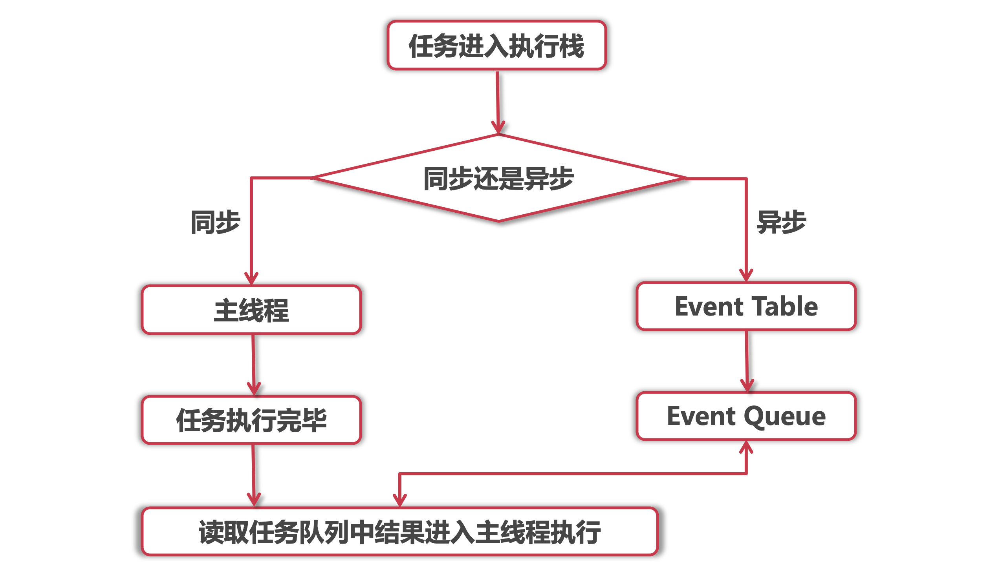

# ES6语法解析学习

> http://es.xiecheng.live/
>
> 学习文档过程中的不完善笔记，感谢作者的贡献👏

## 新的声明方式

### 作用域

作用域：全局作用域、函数作用域、块状作用域、动态作用域。

#### 函数作用域

获取函数作用域的方法：return 或者 闭包。

``` javascript
//闭包
function outside(){
  var name = 'a';
  function inside(){
    return name;
  }
  return inside();
}
```


#### 块状作用域

就是 {} 包裹的地方

``` javascript
if (true) {
    let a = 1
    console.log(a)
}
```


#### 动态作用域

变量的作用域是在定义的时候决定的。

### let

let 声明的全局变量不是全局对象的属性

let 定义变量不允许重复声明

let声明的变量不存在变量提升

``` javascript
function foo() {
    console.log(a)
    let a = 5
}

foo()
// Uncaught ReferenceError: Cannot access 'a' before initialization
```

let 声明的变量存在暂时性死区

``` javascript
var a = 5
if (true) {
    a = 6
    let a
}
// Uncaught ReferenceError: Cannot access 'a' before initialization

//比较隐蔽的
function foo(b = a, a = 2) {
    console.log(a, b)
}
foo()
// Uncaught ReferenceError: Cannot access 'a' before initialization
```

let 声明的变量有块级作用域

``` javascript
{
    let a = 5
}
console.log(a) // undefined
//代码块是在 {} 内部定义的，外部无法访问。
```

### const

const 定义的常量必须同时进行初始化

基本数据类型存储在 **栈内存** 中，引用数据类型存储在 **堆内存** 中。


const 无法保证引用数据类型不改动。只能保证变量指向的那个内存地址中的值不改动。

可以使用 `Obeject.freeze(obj)` 对引用进行浅层冻结。

## 解构赋值

### 数组的解构赋值

赋值元素可以是任意的可遍历对象。

被赋值的变量还可以是对象的属性

解构赋值可以在循环体中使用，配合 entries

``` javascript
let user = {
  name: 'John',
  age: 30
}

// loop over keys-and-values
for (let [key, value] of Object.entries(user)) {
  console.log(`${key}:${value}`) // name:John, then age:30
}

//map 对象依然适用
let user = new Map()
user.set('name', 'John')
user.set('age', '30')

for (let [key, value] of user.entries()) {
  console.log(`${key}:${value}`) // name:John, then age:30
}
```

可以跳过赋值元素，如果想忽略数组的某个元素对变量进行赋值，可以逗号来处理。

rest 参数。使用 rest 参数来接受赋值数组的剩余参数，不过必须放在赋值变量的后面。

``` javascript
let [name1, name2, ...rest] = ["Julius", "Caesar", "Consul", "of the Roman Republic"]

console.log(name1) // Julius
console.log(name2) // Caesar
```

### 对象解构赋值

基本用法，左侧赋值结构必须与右边一样，顺序可以不同

``` javascript
let options = {
  title: "Menu",
  width: 100,
  height: 200
}

let {title, width, height} = options
//等同于
let {title: title, width: width, height: height} = options

let {width: w, height: h, title} = options
```

赋值可以指定默认值

``` javascript
let {width = 100, height = 200, title} = options
```

rest 运算符，与数组中的用法类似，用来承接剩余的参数，一定要放在后面。

嵌套赋值，只要左边赋值元素与右边结构一致，就可以被赋值。

### 字符串解构赋值

``` javascript
let str = 'imooc'

let [a, b, c, d, e] = str 
```

## Array

### es5 中数组遍历方式

for 循环

``` javascript
for (let i = 0; i < arr.length; i++) {
    console.log(arr[i])
}
```

forEach() 没有返回值，只是针对每个元素调用 function

``` javascript
arr.forEach(function(elem, index, array) {
    if (arr[i] == 2) {
        continue
    }
    console.log(elem, index)
})
```

map() 返回新的数组，每个元素为调用 func 的结果

filter() 返回符合 func 条件的元素数组

some() 返回boolean，判断是否有元素符合 func 条件

every() 返回boolean，判断每个元素都符合func条件，every 可以做到 break 的效果。

reduce() 接受一个函数作为累加器

for...in 也可以遍历数组，不推荐

### es6 中数组遍历方式 for...of

 ``` javascript
for (variable of iterable) {}
//es6 允许开发者自定义遍历，任何数据结构都可以自定义实现一个遍历，这个遍历不能被 for for...in 理解。
// for...of 可以支持 continue break
 ```


### Array.from()

js 中有一些伪数组，看着像数组，但是不能使用数组的API

``` javascript
//伪数组特征，使用索引存储值，有 length 属性。
let arrayLike = {
  0:'a',
  1:'b',
  2:'c',
  length:3
}
```


比如函数的 arguments、DOM中的 NodeList

使用 call 改变数组方法的上下文，来间接使用数组方法。

```javascript
let args = [].slice.call(arguments)
let imgs = [].slice.call(document.querySelectorAll('img'))
```

使用 Array.from 

``` javascript
let args = Array.from(arguments);
let imgs = Array.from(document.querySelectorAll('img'));
```

语法

``` javascript
Array.from(arrayLike[, mapFn[, thisArg]])
arrayLike //伪数组 or 可迭代对象
mapFn //每个元素执行的回调函数
thisArg //回调函数的 this 对象
```

初始化一个数组

``` javascript
let arr = Array.from({
  length:5
},function() {
  return 1
})
```


### Array.of()

可以创建数组，不固定长度。

``` javascript
Array.of(7); // [7]
Array.of(1, 2, 3); // [1, 2, 3]

//Array() 创建的是 empty 数组，不是 undefined
Array(7); // [ , , , , , , ]
Array(1, 2, 3); // [1, 2, 3]
```

### Array.prototype.fill()

填充数组的方法

语法

``` javascript
arr.fill(value[, start[, end]])
value //填充的值
start //起始索引
end //结束索引，不包含。默认 this.length

Array(5).fill(1)
//[1,1,1,1,1]
//可以看到，单数值的时候，默认全部填充
```

### Array.prototype.find()

返回使 **回调函数返回true** 的数组中的第一个**值**

语法

``` javascript
arr.find(callback[, thisArg])
callback // 接收 element, index ,array
thisArg //回调函数的 this 对象
```

Array.prototype.findIndex()

返回使 **回调函数返回true** 的数组中的第一个值的**索引**

语法

``` javascript
arr.findIndex(callback[,thisArg])
callback //接收 element index array
thisArg //回调函数的 this 对象
```

### Array.prototype.copyWithin()

在数组内部，将指定位置的成员复制到其他位置

语法

``` javascript
arr.copyWithin(target, start = 0, end = this.length)
target //目标位置
start //读取起始位置，默认0
end //读取结束位置，不包含。默认 this.length
```

## Function

#### 默认参数

``` javascript
function f(x, y = 7, z = 42) //默认参数
function f(x, y = 7, z = x + y) //支持运算
function ajax(url, { //奇怪写法
    body = '',
    method = 'GET',
    headers = {}
} = {})
```

判断 function 的参数

``` javascript
arguments.length //函数执行时传入的参数个数
Function.length //统计默认参数之前的参数的个数
```

#### Rest参数

``` javascript
//es5 写法
function sum() {
    let num = 0
    Array.prototype.forEach.call(arguments, function(item) {
        num += item * 1
    })
    return num
}

//es6 写法
function sum(...nums) {
    let num = 0
    nums.forEach(function(item) {
        num += item * 1
    })
    return num
}

console.log(sum(1, 2, 3)) // 6
console.log(sum(1, 2, 3, 4)) // 10
```

#### 扩展运算符

rest parameter 将参数收集到数组，spread operater 将数组分散到参数。这两个是互逆的操作。

``` javascript
function sum(x = 1, y = 2, z = 3) {
    return x + y + z
}

console.log(sum(...[4])) // 9
console.log(sum(...[4, 5])) // 12
console.log(sum(...[4, 5, 6])) // 15
```

#### name 属性

``` javascript
function foo() {}

foo.name // "foo"
```

#### 箭头函数

``` javascript
let hello = (name) => {
    console.log('say hello', name)
}
// 或者,多个参数一定要带括号

let hello = name => {
    console.log('say hello', name)
}
```

如果返回值是表达式

```js
  let pow = x => x * x
```

如果返回值是字面量对象，一定要小括号包裹起来

```js
  let person = (name) => ({
      age: 20,
      addr: 'Beijing City'
  })
```

注意箭头函数的 this 指向

## Object

### 属性简介表示法

``` javascript
  let name = 'xiecheng'
  let age = 34
  let obj = {
      name,
      age,
      study() {
          console.log(this.name + '正在学习')
      }
  }
```

### 属性名表达式

``` javascript
//在 ES6 可以直接用变量或者表达式来定义Object的 key  
let s = 'school'
  let obj = {
      foo: 'bar',
      [s]: 'imooc'
  }
  //{foo: "bar", school: "imooc"}
```

### Object.is()

判断两个对象是否相等

### Object.assign()

将源对象的值赋值给目标对象，返回目标对象

### 对象的遍历方式

``` javascript
//四种方法
for (let key in obj) {
    console.log(key, obj[key])
}

Object.keys(obj).forEach(key => {
    console.log(key, obj[key])
})

Object.getOwnPropertyNames(obj).forEach(key => {
    console.log(key, obj[key])
})

Reflect.ownKeys(obj).forEach(key => {
    console.log(key, obj[key])
})
```

## Class

### 声明类

```javascript
let Animal = function(type) {
    this.type = type
}

Animal.prototype.walk = function() {
    console.log( `I am walking` )
}

let dog = new Animal('dog')
let monkey = new Animal('monkey')

//使用 class
class Animal {
    constructor(type) {
        this.type = type
    }
    walk() {
        console.log( `I am walking` )
    }
}
let dog = new Animal('dog')
let monkey = new Animal('monkey')
```

### Setters & Getters

有时候我们真的需要设置一个私有属性(闭包)，然后通过一定的规则来限制对它的修改，利用 set/get就可以轻松实现。

### 静态方法

```javascript
// es5
let Animal = function(type) {
    this.type = type
    this.walk = function() {
        console.log( `I am walking` )
    }
}

Animal.eat = function(food) {
    console.log( `I am eating` )
}

//es6
class Animal {
    constructor(type) {
        this.type = type
    }
    walk() {
        console.log( `I am walking` )
    }
    static eat() {
        console.log( `I am eating` )
    }
}
```

### 继承

```javascript
class Animal {
    constructor(type) {
        this.type = type
    }
    walk() {
        console.log( `I am walking` )
    }
    static eat() {
        console.log( `I am eating` )
    }
}

class Dog extends Animal {
  constructor () {
    super('dog')
  }
  run () {
    console.log('I can run')
  }
}
```

## Symbol

es6引入的一种新的数据类型

Symbol函数前不能使用new命令，否则会报错。这是因为生成的 Symbol 是一个原始类型的值，不是对象。也就是说，由于 Symbol 值不是对象，所以不能添加属性。

### Symbol.for()

`Symbol.for()` 接受一个字符串作为参数，然后搜索有没有以该参数作为名称的 Symbol 值。如果有，就返回这个 Symbol 值

### Symbol.keyFor()

Symbol.keyFor()方法返回一个已登记的 Symbol 类型值的key。

### 作为属性名

``` javascript
const stu1 = Symbol('李四')
const stu2 = Symbol('李四')
const grade = {
    [stu1]: {
        address: 'yyy',
        tel: '222'
    },
    [stu2]: {
        address: 'zzz',
        tel: '333'
    },
}
console.log(grade)
console.log(grade[stu1])
console.log(grade[stu2])
```

### 属性遍历

``` javascript
for...in //无法发现 symbol
for...of Object.keys() //无法发现 symbol
for...of Object.getOwnPropertySymbol() //只能发现 symbol
for...of Reflect.ownKeys() //全部发现

```

###  消除魔术字符串

``` javascript
const shapeType = {
    triangle: Symbol(),
    circle: Symbol()
}

function getArea(shape) {
    let area = 0
    switch (shape) {
        case shapeType.triangle:
            area = 1
            break
        case shapeType.circle:
            area = 2
            break
    }
    return area
}
console.log(getArea(shapeType.triangle))
```

## Set

ES6 提供了新的数据结构 Set。它类似于数组，但是成员的值都是唯一的，没有重复的值。

```js
 // 删除指定数据
  s.delete('hello') // true
  // 删除全部数据
  s.clear()

  // 判断是否包含数据项，返回 true 或 false
  s.has('hello') // true
  // 计算数据项总数
  s.size // 2

//数组去重
let arr = [1, 2, 3, 4, 2, 3]
let s = new Set(arr)

//合并去重，并集
let arr1 = [1, 2, 3, 4]
let arr2 = [2, 3, 4, 5, 6]
let s = new Set([...arr1, ...arr2])
console.log(s)
console.log([...s])
console.log(Array.from(s))

//交集
let s1 = new Set(arr1)
let s2 = new Set(arr2)
let result = new Set(arr1.filter(item => s2.has(item)))
console.log(Array.from(result))

//差集
let arr3 = new Set(arr1.filter(item => !s2.has(item)))
let arr4 = new Set(arr2.filter(item => !s1.has(item)))
console.log(arr3)
console.log(arr4)
console.log([...arr3, ...arr4])
```

### 遍历方式

keys()：返回键名的遍历器
values()：返回键值的遍历器
entries()：返回键值对的遍历器
forEach()：使用回调函数遍历每个成员
for...of：可以直接遍历每个成员

``` javascript
  console.log(s.keys()) // SetIterator {"hello", "goodbye"}
  console.log(s.values()) // SetIterator {"hello", "goodbye"}
  console.log(s.entries()) // SetIterator {"hello" => "hello", "goodbye" => "goodbye"}
  s.forEach(item => {
      console.log(item) // hello // goodbye
  })

  for (let item of s) {
      console.log(item)
  }

  for (let item of s.keys()) {
      console.log(item)
  }

  for (let item of s.values()) {
      console.log(item)
  }

  for (let item of s.entries()) {
      console.log(item[0], item[1])
  }
```

### WeakSet

```  javascript
let ws = new WeakSet()
const obj1 = {
    name: 'imooc'
}
const obj2 = {
    age: 5
}
ws.add(obj1)
ws.add(obj2)
ws.delete(obj1)
console.log(ws)
console.log(ws.has(obj2))
```

## Map

Object 结构提供了“字符串—值”的对应，Map 结构提供了“值—值”的对应

``` javascript
let map = new Map([iterable])

//添加
let keyObj = {}
let keyFunc = function() {}
let keyString = 'a string'

// 添加键
map.set(keyString, "和键'a string'关联的值")
map.set(keyObj, '和键keyObj关联的值')
map.set(keyFunc, '和键keyFunc关联的值')

// 删除指定的数据
map.delete(keyObj)
// 删除所有数据
map.clear()

// 统计所有 key-value 的总数
console.log(map.size) //2
// 判断是否有 key-value
console.log(map.has(keyObj)) // true

console.log(map.get(keyObj)) // 和键keyObj关联的值
```


### 遍历方式

keys() 返回一个新的 Iterator 对象。它包含按照顺序插入 Map 对象中每个元素的 key 值
values() 方法返回一个新的 Iterator 对象。它包含按顺序插入Map对象中每个元素的 value 值
entries() 方法返回一个新的包含 [key, value] 对的 Iterator ? 对象，返回的迭代器的迭代顺序与 Map 对象的插入顺序相同
forEach() 方法将会以插入顺序对 Map 对象中的每一个键值对执行一次参数中提供的回调函数
for...of 可以直接遍历每个成员

```js
   map.forEach((value, key) => console.log(value, key))

   for (let [key, value] of map) {
       console.log(key, value)
   }

   for (let key of map.keys()) {
       console.log(key)
   }

   for (let value of map.values()) {
       console.log(value)
   }

   for (let [key, value] of map.entries()) {
       console.log(key, value)
   }
```

- **键的类型**

  一个Object的键只能是字符串或者 Symbols，但一个 Map 的键可以是任意值，包括函数、对象、基本类型。

- **键的顺序**

  Map 中的键值是有序的，而添加到对象中的键则不是。因此，当对它进行遍历时，Map 对象是按插入的顺序返回键值。

- **键值对的统计**

  你可以通过 size 属性直接获取一个 Map 的键值对个数，而 Object 的键值对个数只能手动计算。

- **键值对的遍历**

  Map 可直接进行迭代，而 Object 的迭代需要先获取它的键数组，然后再进行迭代。

- **性能**

  Map 在涉及频繁增删键值对的场景下会有些性能优势。

### Weakmap

WeakMap结构与Map结构类似，也是用于生成键值对的集合。

## String

ES6 对这一点做出了改进，只要将码点放入大括号，就能正确解读该字符。

```js
"\u{20BB7}"
// "𠮷"
```

### 遍历器接口

```js
for (let item of 'imooc') {
    console.log(item)
}
```


### Tag Literal

函数调用的时候有点特别

```js
function Price(strings, type) {
    let s1 = strings[0]
    const retailPrice = 20
    const wholesalePrice = 16
    let txt = ''
    if (type === 'retail') {
        txt = `购买单价是：${retailPrice}` 
    } else {
        txt = `批发价是：${wholesalePrice}` 
    }
    return `${s1}${txt}` 
}
//这里
let showTxt = Price `您此次的${'retail'}` 

console.log(showTxt) //您此次的购买单价是：20
```


### 拓展方法

```javascript
//识别大于0xFFFF的字符
String.prototype.fromCodePoint()
String.prototype.includes()
String.prototype.indexof()
String.prototype.startsWith()
String.prototype.endsWith()
String.prototype.repeat()
```

## RefExp

#### y修饰符

y修饰符的作用与g修饰符类似，也是全局匹配

不同之处在于，g修饰符只要剩余位置中存在匹配就可，而y修饰符确保匹配必须从剩余的第一个位置开始

```javascript
const regexp = /a/g

// 指定从2号位置（y）开始匹配
regexp.lastIndex = 2

// 匹配成功
const match = regexp.exec('xaya')

// 在3号位置匹配成功
console.log(match.index) // 3

// 下一次匹配从4号位开始
console.log(regexp.lastIndex) // 4

// 4号位开始匹配失败
regexp.exec('xaxa') // null
```

上面代码中，lastIndex属性指定每次搜索的开始位置

y修饰符同样遵守lastIndex属性，但是要求必须在lastIndex指定的位置发现匹配

> sticky 模式在正则匹配过程中只会影响两件事：
>
> - 匹配必须从 re.lastIndex 开始（相当于正则表达中的 ^）
> - 如果匹配到会修改 re.lastIndex（相当于 g 模式）

### u修饰符

## Number

### 二进制与十进制转换

```javascript
const a = 5 // 101
console.log(a.toString(2))

const b = 101
console.log(parseInt(b, 2))
```

ES6 提供了二进制和八进制数值的新的写法，分别用前缀0b（或0B）和0o（或0O）表示。

### 新增方法

```javascript
Number.isFinite()
Number.isNaN()
Number.parseInt()
Number.parseFloat()
Number.isInteger()
Number.MAX_SAFE_INTEGER
Number.MIN_SAFE_INTEGER
Number.isSafeInteger()
```

## Math拓展

```javascript
Math.trunc()	//去除小数，返回整数
Math.sign()		//用来判断
Math.cbrt()	  //计算一个数的立方根
```

## Proxy

在 ES6 标准中新增的一个非常强大的功能是 Proxy，它可以自定义一些常用行为如查找、赋值、枚举、函数调用等

### 基本语法

``` javascript
let p = new Proxy(target, handler)
target //let p = new Proxy(target, handler)
handler //一个对象，其属性是当执行一个操作时定义代理的行为的函数
```

### 拦截操作场景

#### 场景一

从服务端获取的数据希望是只读

```js
for (let [key] of Object.entries(response.data)) {
    Object.defineProperty(response.data, key, {
        writable: false
    })
}
```

#### 场景二

数据校验，这里将数据校验放在另外的文件中

```js
export default (obj, key, value) => {
    if (Reflect.has(key) && value > 20) {
        obj[key] = value
    }
}

import Validator from './Validator'
let data = new Proxy(response.data, {
    set: Validator
})
```

#### 场景三

对读写进行监控，在全局对象上，添加了 error 监听

```js
let validator = {
    set(target, key, value) {
        if (key === 'age') {
            if (typeof value !== 'number' || Number.isNaN(value)) {
                throw new TypeError('Age must be a number')
            }
            if (value <= 0) {
                throw new TypeError('Age must be a positive number')
            }
        }
        return true
    }
}
const person = {
    age: 27
}
const proxy = new Proxy(person, validator)
proxy.age = 'foo'
// <- TypeError: Age must be a number
proxy.age = NaN
// <- TypeError: Age must be a number
proxy.age = 0
// <- TypeError: Age must be a positive number
proxy.age = 28
console.log(person.age)
// <- 28

// 添加监控
window.addEventListener(
    'error',
    e => {
        console.log(e.message) // Uncaught TypeError: Age must be a number
    },
    true
)
```

场景四

实例化对象，并且对象的 id 是独一无二的。

```js
class Component {
    constructor() {
        this.proxy = new Proxy({
            id: Math.random().toString(36).slice(-8)
        })
    }
    get id() {
        return this.proxy.id
    }
}
```

### 常见拦截操作

> 所有 Proxy 对象在实例化的时候，必须使用 target 对象的同名参数来接受，否则不能进行拦截。

#### get

拦截对象属性的读取，函数必须返回值

```js
arr = new Proxy(arr, {
    get(target, prop) {
        // console.log(target, prop)
        return prop in target ? target[prop] : 'error'
    }
})
```

#### set

拦截对象的赋值，函数必须返回 boolean

```js
arr = new Proxy(arr, {
    set(target, prop, val) {
        if (typeof val === 'number') {
            target[prop] = val
            return true
        } else {
            return false
        }
    }
})
```

#### has

拦截 in 操作，函数返回 boolean

```js
range = new Proxy(range, {
    has(target, prop) {
        return prop >= target.start && prop <= target.end
    }
})
```

#### ownKeys

拦截Object.getOwnPropertyNames(proxy)、Object.getOwnPropertySymbols(proxy)、Object.keys(proxy)、for...in循环，返回一个数组

```js
userinfo = new Proxy(userinfo, {
    ownKeys(target) {
        return Object.keys(target).filter(key => !key.startsWith('_'))
    }
})
```

#### deleteProperty

拦截delete proxy[propKey]的操作，返回一个布尔值

```js
deleteProperty(target, prop) { // 拦截删除
        if (prop.startsWith('_')) {
            throw new Error('不可删除')
        } else {
            delete target[prop]
            return true
        }
    },
```

#### apply

拦截 Proxy 实例作为函数调用的操作，比如proxy(...args)

```js
sum = new Proxy(sum, {
    apply(target, ctx, args) {
        return target(...args) * 2
    }
})
```

#### construct

拦截 Proxy 实例作为构造函数调用的操作，比如new proxy(...args)

```js
User = new Proxy(User, {
    construct(target, args, newTarget) {
        console.log('construct')
        return new target(...args)
    }
})
```

## Reflect

### 设计目的

- 将Object属于语言内部的方法放到Reflect上
- 修改某些Object方法的返回结果，让其变得更合理
- 让Object操作变成函数行为
- Reflect对象的方法与Proxy对象的方法**一一对应**，只要是Proxy对象的方法，就能在Reflect对象上找到对应的方法。

Reflect的所有属性和方法都是静态的（就像Math对象）

#### 常用方法

- Reflect.defineProperty()
- Reflect.deleteProperty()
- Reflect.getOwnPropertyDescriptor()
- Reflect.set()
- Reflect.get()
- Reflect.has()
- Reflect.apply()
- Reflect.ownKeys()
- Reflect.construct()
- Reflect.preventExtensions()
- Reflect.getPrototypeOf()
- Reflect.setPrototypeOf()
- Reflect.isExtensible()

## Promise

### 异步操作前置知识




```js
//创建 XML 对象
const url = 'http://jsonplaceholder.typicode.com/users'
let xmlhttp
if (window.XMLHttpRequest) { // code for IE7+, Firefox, Chrome, Opera, Safari
    xmlhttp = new XMLHttpRequest()
} else { // code for IE6, IE5
    xmlhttp = new ActiveXObject("Microsoft.XMLHTTP")
}

// 发送请求
xmlhttp.open("GET", url, true)
xmlhttp.send()

// 服务端响应
xmlhttp.onreadystatechange = function() {
    if (xmlhttp.readyState == 4 && xmlhttp.status == 200) {
        //    console.log(xmlhttp.responseText)
        let obj = JSON.parse(xmlhttp.responseText)
        console.log(obj)
    }
}
```

### 基本语法

语法

```js
const promise = new Promise(function(resolve, reject) {
    // ... some code

    if ( /* 异步操作成功 */ ) {
        resolve(value)
    } else {
        reject(error)
    }
})
```

Promise.prototype.then()

Promise.prototype.catch()

Promise.resolve()

```js
//以下形式的语法糖，可以快速使用 Promise 的 resolve 状态
new Promise(function(resolve) {
    resolve(42)
})
```

Promise.reject()

```js
//以下形式的语法糖，可以快速使用 Promise 的 resolve 状态
new Promise(function(resolve, reject) {
    reject(new Error('出错了'))
})
```

Promise.all()

Promise.race()

## Generator

Generator 就是可以控制迭代器的函数

```js
function* generatorForLoop() {
    for (let i = 0; i < 5; i += 1) {
        yield console.log(i)
    }
}

//在获取迭代器的时候，Generator 需要执行一下
const genForLoop = generatorForLoop()
```

### 基本语法

#### 语法

- 比普通函数多一个 *
- 函数内部用 yield 来控制程序的执行的“暂停”
- 函数的返回值通过调用 next 来“恢复”程序执行

> Generator 函数的定义不能使用箭头函数，否则会触发 SyntaxError 错误

#### yield 表达式

> yield 关键字用来暂停和恢复一个生成器函数

1. yield 在函数内的返回值是 undefined，使用 .next() 返回值正常

2. yeild * 是委托给另一个遍历器对象或者可遍历对象

3. Generator 对象的 next 方法，遇到 yield 就暂停，并返回一个对象，这个对象包括两个属性：value 和 done

#### 方法

Generator 对象有几个方法，next、return、throw

##### next([value])

next 是可以接受参数的，这个参数可以让你在 Generator 外部给内部传递数据，而这个参数就是作为 yield 的返回值

> 要注意，首次使用 next() 的时候，传入的参数往往无效。

##### return([value])

return 使 Generator 遍历终止，也可以携带参数

##### throw()

可以通过 throw 方法在 Generator 外部控制内部执行的“终断”

#### 应用场景

场景一

异步操作，按顺序读取

```js
function request(url) {
    ajax(url, res => {
        getData.next(res)
    })
}

function* gen() {
    let res1 = yield request('static/a.json')
    console.log(res1)
    let res2 = yield request('static/b.json')
    console.log(res2)
    let res3 = yield request('static/c.json')
    console.log(res3)
}
let getData = gen()
getData.next()
```

场景二

无限生成器

```js
function* count(x = 1) {
    while (true) {
        if (x % 7 === 0) {
            yield x
        }
        x++
    }
}
// es5中就是个死循环 因为es5的循环需要有个终止值，但我们这个需求没有终止，一直在数数
let n = count()
console.log(n.next().value)
console.log(n.next().value)
console.log(n.next().value)
console.log(n.next().value)
console.log(n.next().value)
console.log(n.next().value)
```

## Iterator

### 基本语法

Iterator 是用来实现自定义遍历的接口

1. 迭代器协议

- 是一个对象
- 对象包含一个无参函数 next()
- next 返回一个对象，对象包含 done 和 value 属性

```js
authors[Symbol.iterator] = function() {
    let allAuthors = this.allAuthors
    let keys = Reflect.ownKeys(allAuthors)
    let values = []
    return {
        next() {
            if (!values.length) {
                if (keys.length) {
                    values = allAuthors[keys[0]]
                    keys.shift()
                }
            }
            return {
                done: !values.length,
                value: values.shift()
            }
        }
    }
}
```

2. 可迭代协议

可迭代协议允许 JavaScript 对象去定义或定制它们的迭代行为

为了变成可迭代对象， 一个对象必须实现 @@iterator 方法, 意思是这个对象（或者它原型链 prototype chain 上的某个对象）必须有一个名字是 Symbol.iterator 的属性:

| 属性 | 值 | 
|:--:|:--:|
| [Symbol.iterator] | 	返回一个对象的无参函数，被返回对象符合迭代器协议 |

### Generator

Generator 函数，拥有 next()，执行返回 {done, value }，符合迭代器协议

## Module

1. export
2. as
3. export default
4. import

