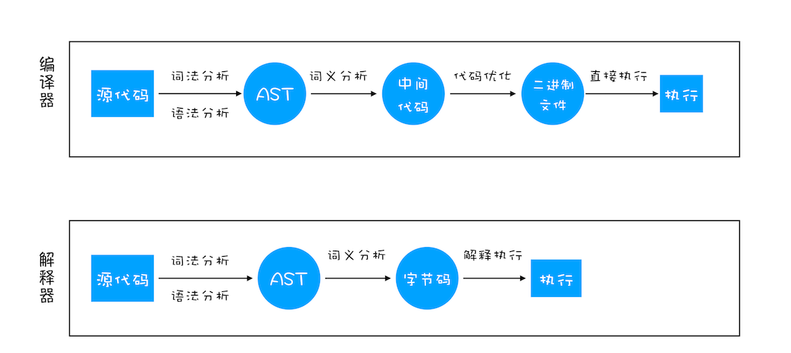

> https://github.com/ravencrown/blog/issues/60
>
> https://github.com/ravencrown/blog/issues/61
>
> https://github.com/ravencrown/blog/issues/62
>
> 学习文档过程中的不完善笔记，感谢作者的贡献👏

# V8 工作原理

编译器（Compiler）、解释器（Interpreter）、抽象语法树（AST）、字节码（Bytecode）、即时编译器（JIT）

编程语言分为: 编译型和解释型

编译型: C/C++ go

解释型: Python JavaScript

js 中目前共八种数据类型，添加了 BigInt 类型

js 中三种内存空间：代码空间、栈空间、堆空间

栈的空间不会太大，主要存放一些小的数据。引用数据类型的空间一般比较大，这一类数据都存放在堆里。堆的空间很大，分配和回收内存都会占用一定的时间

在 js 中使用闭包，会在堆空间中创建一个 clourse 对象，用来保存闭包中的数据

在一个函数执行完成后，js 引擎会向下移动 ESP 来销毁该函数保存在栈中的执行上下文

垃圾回收建立在代际假说的基础上

代际假说：
- 大部分对象在内存中的时间很短
- 不被回收的对象，会存在很久

V8 会把堆空间分为**新生代**和**老生代**两个区域，新生代存放的是生存时间短的对象，老生代存放的是生存时间长的对象

新生代区域通常只有 1~8M 的容量，老生代区域就比较大

- 副垃圾回收器，负责新生代的回收
- 主垃圾回收器，负责老生代的回收

### 垃圾回收器的工作流程

V8 使用两个类型的垃圾回收期，但是工作流程相同

1. 标记空间中的活动对象和非活动对象
2. 标记完成后，统一清理非活动的对象
3. 内存清理，针对内存碎片

### 副垃圾回收器

新生代中用 Scavenge 算法来处理。所谓 Scavenge 算法，是把新生代空间对半划分为两个区域，一半是对象区域，一半是空闲区域。

新加入的对象都会存放到对象区域，当对象区域快被写满时，就需要执行一次垃圾清理操作

在垃圾回收过程中，首先要对对象区域中的垃圾做标记；标记完成之后，就进入垃圾清理阶段，副垃圾回收器会把这些存活的对象复制到空闲区域中，同时它还会把这些对象有序地排列起来

新生代中用 Scavenge 算法来处理。所谓 Scavenge 算法，是把新生代空间对半划分为两个区域，一半是对象区域，一半是空闲区域

### 主垃圾回收器

首先使用 标记-清除 法进行回收，然后使用 标记-整理 法进行整理

js 的垃圾回收实在主进程上的，所以主垃圾回收分为多个步骤，避免对性能的影响