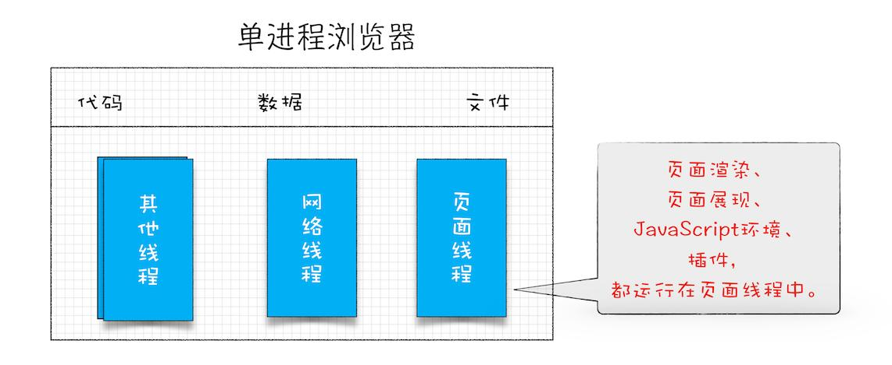
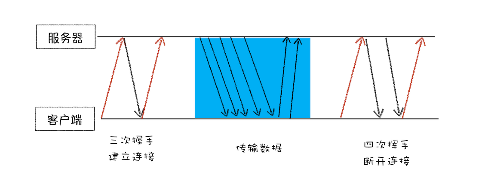
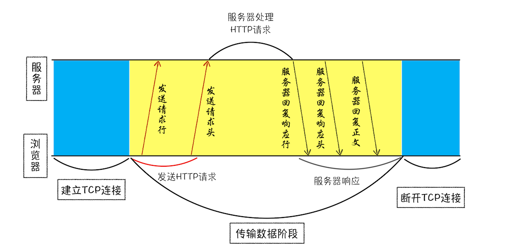

> https://pcaaron.github.io/pages/fe/chrome/
>
> 学习文档过程中的不完善笔记，感谢作者的贡献👏

# 浏览器工作原理简介


# 宏观视角的浏览器

## Chrome 架构

### 进程和线程

计算机中的并行处理就是同一时刻处理多个任务

多线程可以并行处理任务，但是线程是不能单独存在的，它是由进程来启动和管理的

进程和线程的关系

1. 进程中的任意线程执行出错，都会导致整个进程的崩溃
2. 线程之间共享进程中的数据
3. 当一个进程关闭，系统会回收进程所占用的内存
4. 进程之间的内容相互隔离

### 单进程浏览器



单进程浏览器所有的功能模块都是在一个进程中，不稳定、不流畅、也不安全

### 多进程浏览器

浏览器进程：主要负责界面显示、用户交互、子进程管理，同时提供存储等功能。

渲染进程：核心任务是将 HTML、CSS 和 JavaScript 转换为用户可以与之交互的网页， 排版引擎 Blink 和 JavaScript 引擎 V8 都是运行在该进程中，默认情况下，Chrome 会为每个 Tab 标签创建一个渲染进程。 出于安全考虑，渲染进程都是运行在沙箱模式下。

GPU进程：Chrome 刚开始发布的时候是没有 GPU 进程的。而 GPU 的使用初衷是为了实现 3D CSS 的效果， 只是随后网页、Chrome 的 UI 界面都选择采用 GPU 来绘制，最后，Chrome 在其多进程架构上也引入了 GPU 进程。

网路进程：主要负责页面的网络资源加载。

插件进程：主要是负责插件的运行，因插件易崩溃，所以需要通过插件进程来隔离，以保证插件进程崩溃不会对浏览器和页面造成影响。

> 带来的问题：更高的资源占用、更复杂的体系架构

### 面向服务的架构

来的各种模块会被重构成独立的服务（Service）， 每个服务（Service）都可以在独立的进程中运行，访问服务（Service）必须使用定义好的接口，通过 IPC 来通信， 从而构建一个更内聚、松耦合、易于维护和扩展的系统，更好实现 Chrome 简单、稳定、高速、安全的目标

# TCP协议 如何保证页面能被完整送达浏览器

衡量Web页面性能的时候一个重要的指标叫“FB(Firts Paint)”，是指页面加载到 首次开始绘制的时长

而影响FP指标的重要因素是网络加载速度

## 数据包的传输过程

### UDP

UDP 可以校验数据的正确性，错误包直接丢弃，不保证数据可靠，但是数据传输快

### TCP

TCP(传输控制协议)是一种面向连接的、可靠的、基于字节流的传输层通信 协议

完整的 TCP 连接的生命周期包括了“建立连接”“传输数据”和“断开连接”三个阶段S



- 首先，三次握手建立连接
- 传输阶段，接收端会按照序号拼接数据包，并且对接受到的数据包进行确认回复。发送端如果没有在规定时间内收到接收端的确认回复，会重新发送对应数据包
- 最后，四次挥手断开连接

# HTTP 请求流程

HTTP 是允许浏览器向服务器获取 资源的协议，是 web 的基础

## 浏览器发起 HTTP 请求流程

1. 构建请求

首先，浏览器构建请求行

```js
GET /index.html HTTP1.1
```

2. 查找缓存

浏览器缓存是一种在本地保存资源副本，以供下次请求时直接使用的技术

有利于：
- 缓解服务端压力
- 实现网站的快速加载

3. 准备 IP 地址和端口

HTTP 协议是应用层协议，用来封装请求的文本信息



通过 URL 解析来获取 IP 和端口信息，来建立和服务器的 TCP 链接

在解析的时候会使用 DNS(域名解析服务)，在向 DNS 查询之前也会本地查询一下缓存

4. 等待 TCP 队列

Chrome 同一个域名下只能同时存在 6 个 TCP 链接，超出的链接会进入队列

5. 建立 TCP 链接

与服务器进行三次握手，建立 TCP 链接

6. 发送 HTTP 请求

HTTP 请求的数据格式


包含：请求行、请求头、请求体

## 服务器段处理 HTTP 请求路程

1. 返回请求

返回的数据格式：相应行、响应头、响应体


状态码：
- 200 表示处理成功
- 404 没找到页面
- 500 服务器错误

2. 断开连接

```js
Connection:Keep-Alive
```

这样使 TCP 链接持续保持，省去了建立 TCP 链接的过程

3. 重定向


状态 301 表示需要重定向，浏览器会解析 Location 中的 URL 

## 总结


通过上面的图片可以看到：
1. 服务器返回 HTTP 响应头，浏览器通过 **Cache-Control** 来控制是否缓存当前资源，参数中的 Max-age 表明缓存的生命周期

2. 浏览器再次请求，首先访问缓存，如果没有过期，直接命中缓存；如果已经过期，会进行网络请求，并且添加 **If-None-Match** 参数，服务器根据该参数判断资源是否更新

- 如果资源没有更新，返回状态码 304，浏览器会刷新缓存的生命周期，并且命中缓存
- 如果资源有更新，直接返回缓存

3. 浏览器在登陆的时候，使用 POST 提交信息。服务器进行验证，响应头会添加 Set-Cookie 字段返回给浏览器。浏览器保存 Cookie 数据，附加在随后的请求头中

详细 HTTP 过程


# 导航流程：从输入 URL 到页面

输入 URL 到页面展示的流程


整个流程：
- 首先浏览器进程中 **输入请求信息**
- 网络进程发送网络请求
- 服务器响应请求，浏览器进程开始 **准备渲染进程**
- 渲染进程准备好 ，通知浏览器进程。这个阶段称为 **提交文档** 阶段
- 浏览器收到渲染进程 **提交文档** 的消息，开始移除之前的旧文档，然后通知渲染进程‘文档已提交’，然后渲染进程开始进行 **解析页面** 阶段

## 从输入 URL 到页面展示

当用户输入关键字并回车后，在当前页面即将被替换成新页面前，浏览器可给当前页面执行 beforeunload事件

## URL 请求过程

接着浏览器进程会通过 IPC 将 URL 发送给网络进程。

网络进程首先查找本地缓存，没有则进入网络请求流程

1. 重定向

如果服务器返回的状态码为：301 302，网络进程会从响应头中的 Location 字段中提取链接，重新发起网络请求流程

2. 相应数据类型处理

Content-Type 响应体数据类型

Content-Type: text/html HTML格式

Content-Type: application/octet-stream 字节流格式

不同 Content-Type 的后续处理流程也截然不同，Content-Type 字段的值被浏览器判断为下载类型，那么该请求会被提交给浏览器的下载管理器

3. 准备渲染过程

默认的情况下，一个页面一个渲染引擎

如果从一个页面打开另一个页面，并且同属于同一个站点，则共用一个渲染进程

4. 提交文档

- 浏览器进程收到网络进程的响应头后，通知渲染进程**提交文档**
- 渲染进程收到 **提交文档** 消息后，与网络进程建立传输数据‘管道’
- 文档数据传输完成，渲染进程返回 **确认提交** 消息给浏览器进程
- 浏览器收到 **确认提交** 消息后，更新浏览器界面状态

5. 渲染阶段

文档被提交后，渲染进程便开始页面解析和子资源加载。页面加载完成，渲染进程会通知浏览器进程，浏览器进程停止标签的加载动画

## 总结

服务器通过 Content-Type 控制浏览器的行为，如跳转、数据包的下载

Chrome 默认为每个标签页打开一个进程，如果同属于一个指点，则公用一个渲染进程

# 渲染流程 HTML、CSS和JS使如何变成页面的

渲染流水线，按照时间顺序

1. 构建 DOM 树
2. 样式计算
3. 布局阶段
4. 分层
5. 绘制
6. 分块
7. 光栅化和合成

## 构建 DOM 树

由于浏览器无法直接解析HTML，所以需要将HTML转换为浏览器能够理解的结构，DOM树

## 样式计算

1. 当渲染引擎接收到CSS文本时， 会将CSS文本转换为浏览器可以理解的结构，styleSheets
2. 将 CSS 文本中的属性值转化为渲染引擎可以理解的标准值
3. 对 DOM 节点的样式进行计算，依据继承和层叠规则

## 布局阶段

已知 DOM 树和 DOM 树中的样式，接下来计算出 DOM 树中可见元素的几何位置，这个计算过程叫布局

布局阶段的两个过程：创建布局树和布局计算

1. 创建布局树

DOM 树存在一些不可见的元素，所以还需要创建一个包含可见元素的布局树

- 遍历DOM树中所以可见节点，并添加节点到布局中；
- 忽略不可见的节点，如head标签下的内容，display:none等。

2. 布局计算

HTML采用的是 流式布局模型，基本原则是按照元素在顺序遍历过程中依次从左到右、从上 到下的排序方式确定位置区域

## 分层

页面中的特别的效果，比如 3D、z-index

渲染引擎还需要为特定的节点生成专用的图层，并生成一颗对应的 图层树(LayerTree)

浏览器的页面实际上被分层了很多图层，这些图层叠加后合成最终的页面

并不是布局树的每个节点都包含一个图层，如果一个节点没有对应的 层，那么这个节点就从属于父节点的图层

通常满足其下两点中的任意一点即可被提升为单独的一个图层：

1. 拥有层叠上下文属性的元素会被提升为单独的一层

2. 需要剪裁的地方也会被创建为图层

## 图层绘制

完成图层树的构建，渲染引擎会对图层树中的每个图层进行绘制，渲染引擎把图层的绘制拆分为多个的绘制指令

## 栅格化操作

绘制列表只是用来记录绘制顺序和绘制指令的列表，实际的绘制是由渲染引擎中的合成线程来完成的

渲染引擎中的合成线程和主线程


当图层的绘制列表完成后，主线程会把该绘制列表提交给合成线程

合成线程会将图层划分为图块

合成线程会按照视口附近的图快有限生成位图，实际生成的位图的操作是由栅格化来执行的

所谓栅格化，是指将图块转换为位图

## 合成和显示

所有图块都被栅格化，合成线程就会生成一个绘制图块的命令，“DrawQuad”，然后 将该命令提交给浏览器进程

## 总结

综上，一个完整的渲染流程为：

1. 渲染进程将HTML内容转换为浏览器能识别的DOM树结构。

2. 渲染引擎将CSS样式表转化为浏览器可以理解的styleSheets，计算出 DOM节点的样式。

3. 创建布局树，并计算元素的布局信息。

4. 对布局树进行分层，并生成分层树。

5. 为每个图层生成绘制列表，并将其提交给合成线程。

6. 合成线程将图层分成图块，并在栅格化线程池中将图块转换成位图。

7. 合成线程发送绘制图块命
