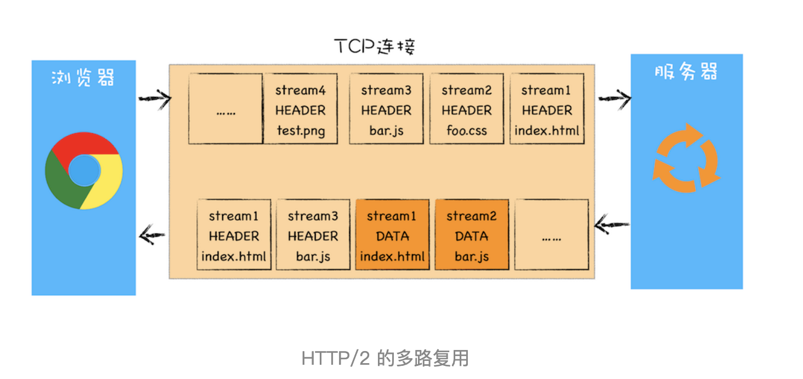
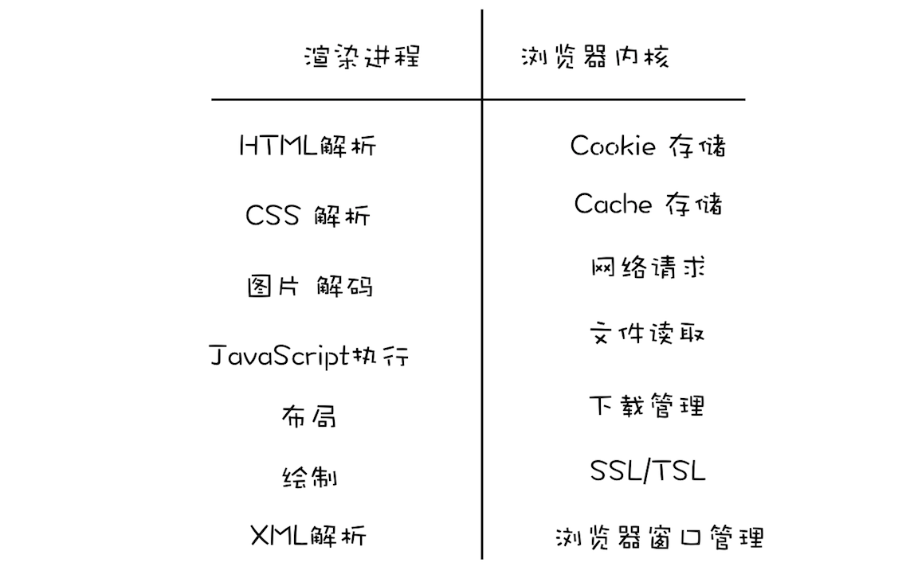
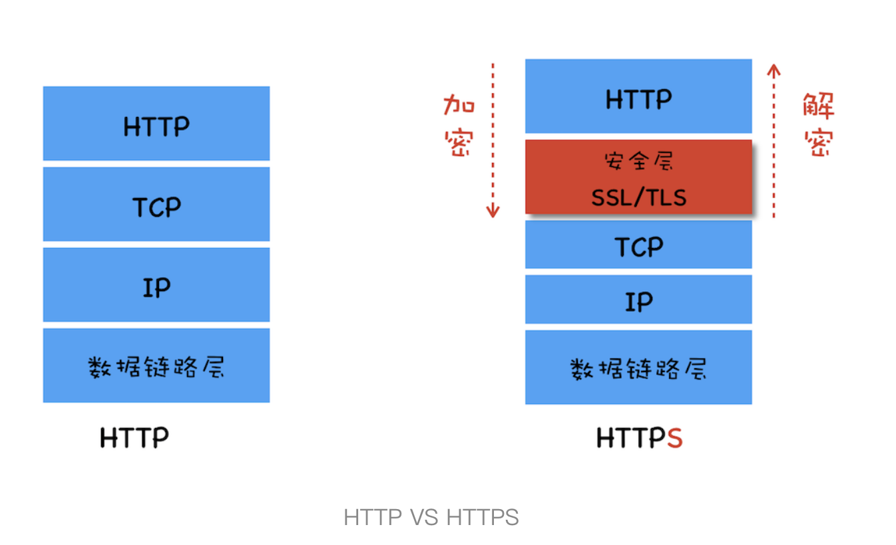
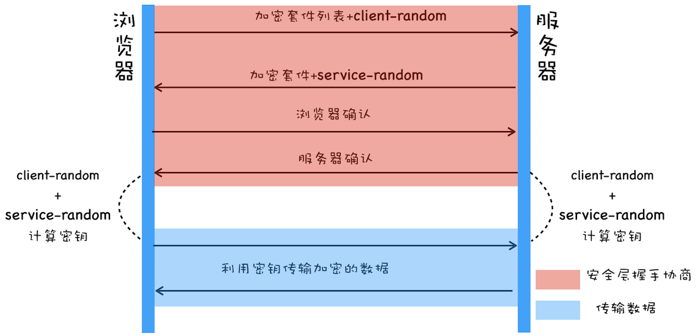

# 浏览器中的网络

## HTTP性能优化

### HTTP/1.1

1. 改进持久连接, 在一个 TCP 连接中进行多个 HTTP 请求
2. 不成熟的 HTTP 管道化, 最后这项技术被放弃
3. 提供虚拟机支持, 在请求头中添加 host 字段, 用来表示当前的域名地址
4. 对动态生成的内容提供了支持, 引入了 Chunk transfer 机制, 服务器将数据分割为任意大小的数据块, 每个数据块发送的时候会附上上一个数据块的长度, 最后使用一个零长度的数据块来作为发送完成的标志.
5. 客户端 Cookie 安全机制

## HTTP2: 提升网络速度

HTTP/1.1 最核心的优化:
- 增加了持久连接
- 浏览器为每个域名最多同时维护 6 个 TCP 持久连接
- 使用 CDN 实现域名分片机制

### HTTP/1.1 的问题

HTTP/1.1 的带宽利用不理想

原因:

1. TCP 启动慢

TCP 协议为了避免网络拥塞, 采用慢启动, 这个没有办法改变.

2. 同时开启多条 TCP 连接, 这些连接会竞争固定的带宽

系统同时建立多条 TCP 连接, 当带宽充足的时候, 每个 TCP 会慢慢向上提速, 当宽带不足的时候, 每个 TCP 会降低速度. 但是 HTTP/1.1 没有办法分辨关键资源, 影响页面中关键资源的加载

3. HTTP/1.1 队头阻塞的问题

HTTP/1.1 协议中, 公用一个 TCP 信道, 但是同一时刻只能处理一个请求, 如果当前的请求没有结束, 其他的请求只能处于阻塞状态

### HTTP/2 的多路复用

HTTP/2 的思路是使用一个 TCP 长连接来传输数据, 这样整个资源的下载过程只需要一次慢启动, 而且可以并发请求来避免队头阻塞的问题

参考图

HTTP/2 的核心**多路复用机制**

每个请求都有各自的 ID, 服务器在收到来自浏览器的请求的时候, 可以筛选出 ID, 根据自己的需求来进行应答

### 多路复用的实现

多了一个**二进制分帧层**, HTTP 请求会经过分帧层, 会转换为一个个带有 ID 编号的帧, 服务器在接收到帧会进行复原, 服务器的相应也会经过分帧层

### HTTP/2 其他特性

基于**二进制分帧层**, 还附带实现了其他功能

1. 可以设置请求的优先级, 发送请求的时候, 标上请求的优先级
2. 服务器推送, 服务器在接收到 HTML 请求之后, 附带将 js 和 CSS 文件一起发送给浏览器, 可以提高首次加载速度
3. 头部压缩, 将响应头和请求头进行压缩

## HTTP3 甩掉TCP、TCL包袱 构建高效网络

### TCP 队头阻塞

在 TCP 传输过程中, 由于单个数据包的丢失而造成的阻塞称为 TCP 的队头阻塞

在 HTTP/2 中也会出现队头阻塞

### TCP 建立连接的延时

TCP 建立时的握手过程也是影响传输效率的一个重要一泥塑

### TCP 协议僵化

数据在传输过程中, 遇到不支持新协议的设备, 数据包会被丢弃

### QUIC 协议

HTTP/2 HTTP/3 的协议栈比较

QUIC 实现了一下几点功能

1. 实现了流量控制 传输可靠性的功能
2. 继承了 TLS 加密功能, 使用的时 TLS1.3
3. 实现了 HTTP/2 中的多路复用功能

## 同源策略：为什么XMLHttpRequst不能跨域请求资源

浏览器安全分为三大块: Web 页面安全 浏览器网络安全和浏览器系统安全

最基础 最核心的安全策略: 同源策略(same-origin policy)

### 同源策略

同协议 域名 端口则同源

三个层面:

1. DOM 层面, 限制了 js 脚本只能操作当前网站的 DOM
2. 数据层面, 限制 js 脚本只能读取当前站点的 Cookie IndexDB LocalStorage 等数据
3. 网络层面, 限制请求只能发送给当前的站点

### 安全和便利性

1. 页面中可以嵌入第三方资源

内容安全策略(CSP), 让服务器决定浏览器能够加载哪些资源, 让服务器决定浏览器能否执行内联 js 代码

2. 跨域资源共享和跨文档消息机制

跨域资源共享(CORS), 该机制可以进行跨域访问控制

浏览器引入可跨文档消息机制, 可以通过 window.postMessage 的 js 接口和不同源的 DOM 进行通信

## 跨站脚本攻击XSS：为什么cookie中有httpOnly属性

Cross Site Scripting 跨站脚本

XSS 攻击就是在 HTML 或者 DOM 中注入恶意脚本

攻击方式:

1. 存储型 XSS 攻击

将恶意代码存储在服务器中

2. 反射型 XSS 攻击

将恶意代码存放在用户侧, 用户触发, 服务器反射给浏览器执行

3. 基于 DOM 的 XSS

### 阻止 XSS 攻击

1. 服务器对输入脚本进行过滤或转码

2. 充分利用 CSP

CSP 的几个功能:

- 限制加载其他域下的资源文件
- 禁止向第三方域提交数据
- 禁止执行内联脚本和未授权脚本
- 提供了上报机制

3. 使用 HttpOnly 属性

HttpOnly 标记的 Cookie 只能使用在 HTTP 请求中, 不能通过 js 来读取, 一些重要的数据设置 HttpOnly 标志

## CSRF 攻击

Cross-site request forgery 跨站请求伪造

CSRF 攻击就是利用用户的登录状态, 通过**第三方**网站来利用用户的身份

攻击方式:
 
1. 自动发起 Get 请求
2. 自动发起 Post 请求
3. 引诱用户点击连接

### 防止 CSRF 攻击

1. 利用 Cookie 的 samesite 属性

SameSite 三个属性: Strict Lax None, 严格程度依次递减

2. 验证请求的来源站点

请求头中的 Origin 和 Refer 属性

3. CSRF Token

服务器生成一个 CSRF Token, 在用户提交表单的时候, 必须提供有效的 CSRF Token

## 沙盒

常见的攻击方式利用**缓冲区溢出**

现代浏览器的体系架构

现代浏览器分为**浏览器内核**和**渲染内核**连个核心模块

### 安全沙箱

将渲染进程和操作系统隔离的就是沙箱技术

沙箱保护的最小单位时进程, 单进程浏览器是无法被安全沙箱保护的, 现代浏览器采用多进程架构使得安全沙箱可以发挥作用

### 沙箱如何影响各个模块的功能

沙箱保护的进程功能会有所受限

1. 持久存储

读写文件的操作全部放在了浏览器内核中实现, 然后通过 IPC 将结果转发给渲染进程

2. 网络访问

渲染进程没有权限访问网络, 交给浏览器内核处理, 但是浏览器内核处理之前会检查渲染进程是否有权限请求该 URL 

3. 用户交互

UI 程序统称为窗口句柄

渲染进程不能直接访问窗口句柄, 所以渲染进程需要完成一下两点的改变

- 第一点, 渲染进程需要渲染出位图, 渲染进程需要将生成好的位图发送到浏览器内核
- 第二点, 操作系统不会将用户的输入事件直接传递给渲染进程, 而是将这些事件经过浏览器内核判断后, 再处理

### 站点隔离

chrome 将同一站点中相互关联的页面放到同一个渲染进程中执行

## HTTPS

### 在协议栈中引入安全层

安全层的职责: 对发起 HTTP 请求的数据进行加密操作和对收到HTTP 的内容进行解密操作

### 第一版: 使用对称加密

对称加密: 加密和解密都是用相同的密钥

加密套件是指加密方法, client-random server-random 是指随机数

不过加密握手过程是明文传输的, 获取加密套件和随机数后, 仍然可以解密信息

### 第二版: 使用非对称加密

非对称加密: 加密和解密的密钥分离

缺点:

1. 非对称加密的效率太低
2. 无法保证服务器发送给浏览器的数据安全

### 第三版: 对称加密和非对称加密

### 第四版: 添加数字证书

中间增加了权威机构认证这个环节

